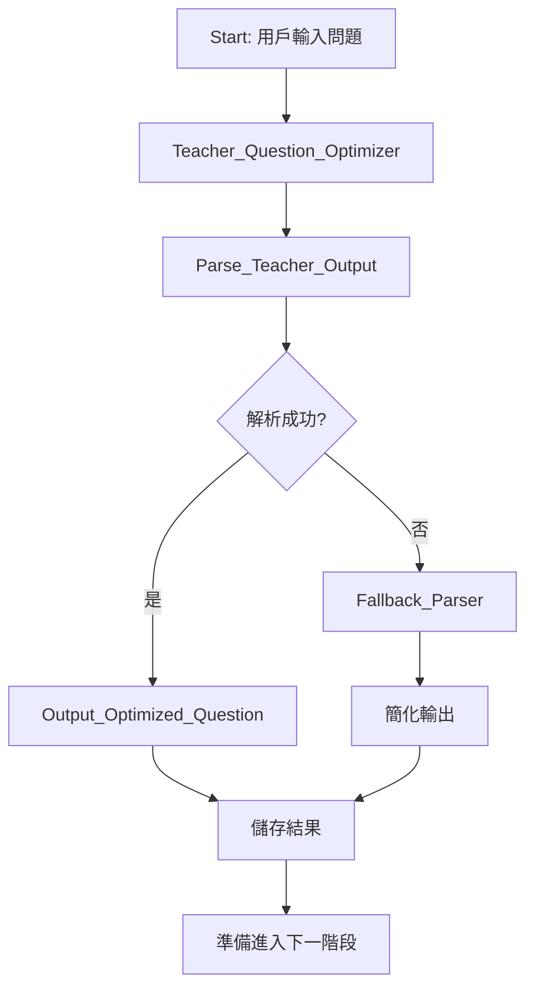

好的！讓我們專注在**第一個節點 - 老師的問題優化與延伸**，我會給你最詳細的 Dify 設置步驟。

## 📝 **第一個節點：老師問題優化 - Dify 實作指南**

### **Step 1: 在 Dify 中創建工作流**

1. 進入 Dify 工作台
2. 點擊「創建應用」→ 選擇「工作流」
3. 選擇「從頭開始構建」

### **Step 2: 設置開始節點**

```yaml
節點名稱: Start
變數設置:
  - 變數名: user_question
  - 類型: 文本
  - 必填: 是
  - 提示文字: "請輸入你想了解的問題"
```

### **Step 3: 添加 LLM 節點（老師）**

#### **基本配置**
```yaml
節點類型: LLM
節點名稱: Teacher_Question_Optimizer
模型: gpt-4 (或 claude-3-opus)
```

#### **系統提示詞 (System Prompt)**
```markdown
你是一位資深的教育專家，專門將簡單的問題轉化為有深度的教學機會。你的角色是：
1. 分析問題的教育價值
2. 優化問題使其更具體、更有深度
3. 從多個角度延伸問題
4. 建立知識架構

回應必須是有效的JSON格式。
```

#### **用戶提示詞 (User Prompt) - 完整版**
```markdown
請分析並優化以下問題：

【原始問題】
{{start.user_question}}

【分析與優化要求】

請完成以下任務並以JSON格式輸出：

1. **問題診斷**
   - 識別問題的核心概念
   - 判斷問題的複雜度（初級/中級/高級）
   - 推測提問者的意圖

2. **問題重構**
   - 將問題改寫得更精確
   - 添加必要的背景脈絡
   - 明確界定討論範圍

3. **多維度延伸**（至少3個不同角度）
   - 理論基礎：相關的基本原理是什麼？
   - 實際應用：如何在現實中運用？
   - 比較分析：與類似概念有何異同？
   - 批判思考：有哪些限制或爭議？
   - 未來發展：未來趨勢如何？

4. **知識地圖**
   - 主要涉及的學科領域
   - 需要的前置知識
   - 可以延伸學習的進階主題

【輸出JSON格式】
{
  "problem_analysis": {
    "core_concept": "識別出的核心概念",
    "complexity_level": "初級/中級/高級",
    "learner_intent": "學習者可能的目的"
  },
  "optimized_question": {
    "refined_version": "優化後更精確的問題表述",
    "context": "補充的背景資訊",
    "scope": "明確的討論範圍"
  },
  "extended_questions": [
    {
      "perspective": "理論基礎",
      "question": "具體的延伸問題",
      "learning_value": "這個問題的教學價值"
    },
    {
      "perspective": "實際應用", 
      "question": "具體的延伸問題",
      "learning_value": "這個問題的教學價值"
    },
    {
      "perspective": "比較分析",
      "question": "具體的延伸問題", 
      "learning_value": "這個問題的教學價值"
    }
  ],
  "knowledge_structure": {
    "primary_domain": "主要知識領域",
    "related_fields": ["相關領域1", "相關領域2"],
    "prerequisites": ["前置知識1", "前置知識2"],
    "advanced_topics": ["進階主題1", "進階主題2"]
  }
}
```

### **Step 4: 添加代碼節點 - 解析JSON**

#### **節點配置**
```yaml
節點類型: 代碼執行
節點名稱: Parse_Teacher_Output
輸入變數: 
  - teacher_output (from: Teacher_Question_Optimizer)
```

#### **Python 代碼**
```python
import json
import re

def main(teacher_output: str) -> dict:
    """
    解析老師的輸出，提取結構化數據
    """
    try:
        # 嘗試找到JSON部分（處理可能的額外文字）
        json_match = re.search(r'\{.*\}', teacher_output, re.DOTALL)
        
        if json_match:
            json_str = json_match.group()
            data = json.loads(json_str)
            
            # 驗證必要欄位
            required_fields = ['problem_analysis', 'optimized_question', 
                             'extended_questions', 'knowledge_structure']
            
            for field in required_fields:
                if field not in data:
                    raise ValueError(f"Missing required field: {field}")
            
            # 格式化輸出供後續使用
            return {
                "status": "success",
                "parsed_data": data,
                "main_question": data['optimized_question']['refined_version'],
                "extended_questions_list": [
                    q['question'] for q in data['extended_questions']
                ],
                "formatted_output": format_for_display(data)
            }
            
    except json.JSONDecodeError as e:
        return {
            "status": "error",
            "error_message": f"JSON解析失敗: {str(e)}",
            "raw_output": teacher_output
        }
    except Exception as e:
        return {
            "status": "error", 
            "error_message": str(e),
            "raw_output": teacher_output
        }

def format_for_display(data: dict) -> str:
    """
    將數據格式化為易讀的文本
    """
    output = []
    
    # 問題分析
    analysis = data['problem_analysis']
    output.append("📊 **問題分析**")
    output.append(f"- 核心概念：{analysis['core_concept']}")
    output.append(f"- 複雜度：{analysis['complexity_level']}")
    output.append(f"- 學習意圖：{analysis['learner_intent']}\n")
    
    # 優化後的問題
    optimized = data['optimized_question']
    output.append("🎯 **優化後的問題**")
    output.append(f"主要問題：{optimized['refined_version']}")
    output.append(f"背景說明：{optimized['context']}")
    output.append(f"討論範圍：{optimized['scope']}\n")
    
    # 延伸問題
    output.append("🔍 **延伸探討方向**")
    for i, q in enumerate(data['extended_questions'], 1):
        output.append(f"\n{i}. [{q['perspective']}]")
        output.append(f"   問題：{q['question']}")
        output.append(f"   價值：{q['learning_value']}")
    
    # 知識結構
    knowledge = data['knowledge_structure']
    output.append("\n📚 **知識架構**")
    output.append(f"- 主要領域：{knowledge['primary_domain']}")
    output.append(f"- 相關領域：{', '.join(knowledge['related_fields'])}")
    output.append(f"- 前置知識：{', '.join(knowledge['prerequisites'])}")
    output.append(f"- 進階主題：{', '.join(knowledge['advanced_topics'])}")
    
    return "\n".join(output)

# 調用主函數
return main(teacher_output)
```

### **Step 5: 添加條件判斷節點**

```yaml
節點類型: 條件分支
節點名稱: Check_Parse_Status
條件設置:
  - 如果: {{Parse_Teacher_Output.status}} == "success"
    - 則: 繼續到下一步
  - 否則: 
    - 則: 進入錯誤處理
```

### **Step 6: 錯誤處理節點（備用方案）**

```yaml
節點類型: LLM
節點名稱: Fallback_Parser
觸發條件: 當JSON解析失敗時
```

**Fallback Prompt:**
```markdown
前一個回應無法正確解析，請重新整理以下內容為標準格式：

原始輸出：
{{Parse_Teacher_Output.raw_output}}

請提取並整理為：
1. 優化後的主要問題
2. 3-5個延伸問題（每個一行）
3. 相關知識領域（用逗號分隔）

格式要求：使用清晰的標題和條列式
```

### **Step 7: 輸出節點配置**

```yaml
節點類型: 回答
節點名稱: Output_Optimized_Question
輸出內容: {{Parse_Teacher_Output.formatted_output}}
```

### **測試用例與預期結果**

#### **測試案例 1：簡單問題**
```
輸入：什麼是AI？

預期優化：
- 主問題：人工智慧的定義、核心技術和應用範圍是什麼？
- 延伸1：機器學習與深度學習的區別？
- 延伸2：AI在不同產業的實際應用案例？
- 延伸3：AI發展的倫理挑戰有哪些？
```

#### **測試案例 2：複雜問題**
```
輸入：如何在Python中實現一個高效的排序算法？

預期優化：
- 主問題：如何根據不同場景選擇並實現最適合的Python排序算法？
- 延伸1：各種排序算法的時間複雜度比較？
- 延伸2：Python內建排序與自定義排序的效能差異？
- 延伸3：如何針對特定數據特徵優化排序效能？
```

### **優化建議**

#### **1. 添加輸入驗證**
```python
# 在代碼節點開始處加入
def validate_input(user_question: str) -> bool:
    """驗證用戶輸入"""
    if not user_question or len(user_question.strip()) < 5:
        return False
    if len(user_question) > 1000:  # 防止過長輸入
        return False
    return True
```

#### **2. 緩存機制**
```yaml
變數設置:
  - cache_questions: 陣列類型
  - 儲存最近10個問題的優化結果
  - 可以快速重用
```

#### **3. 根據問題類型調整 Prompt**
```python
question_types = {
    "定義型": "著重解釋概念和原理",
    "方法型": "著重步驟和實作",
    "比較型": "著重差異和優劣",
    "應用型": "著重實例和場景"
}
```

### **在 Dify 中的完整連接流程**



### **立即可用的簡化版本**

如果想要快速測試，可以先用這個簡化版的 Prompt：

```markdown
分析問題：{{start.user_question}}

請完成：
1. 讓問題更具體明確
2. 提出3個相關的延伸問題
3. 列出涉及的知識領域

用以下格式回答：
【優化問題】
(你的答案)

【延伸問題】
1. (問題1)
2. (問題2)  
3. (問題3)

【知識領域】
(用逗號分隔的領域列表)
```

這樣設置完成後，你就可以在 Dify 中測試第一個節點了！需要我協助調試或者解釋某個特定部分嗎？
