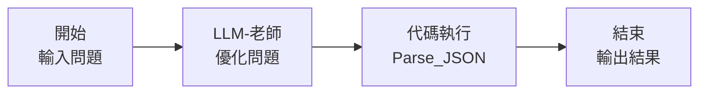

啊！我明白了！在 Dify 的**工作流 (Workflow)** 中，輸出是通過**「結束」節點**來配置的。

## ✅ **正確的做法：使用「結束」節點**

### **Step 1: 添加結束節點**

1. **從節點列表選擇「結束」**
2. **連接代碼節點到結束節點**

```
代碼節點 (Parse_JSON) → 結束節點
```

---

### **Step 2: 配置結束節點的輸出**

點擊「結束」節點後，在右側面板配置：

#### **選項 A: 輸出格式化文本（推薦）**

```yaml
結束節點配置:
  輸出類型: 文本 (Text)
  輸出內容: {{Parse_JSON.formatted_output}}
```

**這會顯示：**
```
📊 **問題分析**
- 核心概念：...
- 複雜度：...
...
```

---

#### **選項 B: 輸出 JSON 結構**

```yaml
結束節點配置:
  輸出類型: JSON
  輸出變數:
    - status: {{Parse_JSON.status}}
    - main_question: {{Parse_JSON.main_question}}
    - formatted_output: {{Parse_JSON.formatted_output}}
    - extended_questions_list: {{Parse_JSON.extended_questions_list}}
```

---

#### **選項 C: 多個輸出欄位**

如果結束節點支援多個欄位，可以這樣設定：

```yaml
輸出欄位 1:
  名稱: 優化問題
  變數: {{Parse_JSON.main_question}}
  
輸出欄位 2:
  名稱: 完整分析
  變數: {{Parse_JSON.formatted_output}}
  
輸出欄位 3:
  名稱: 延伸問題
  變數: {{Parse_JSON.extended_questions_list}}
```

---

## 📋 **完整流程結構**



---

## 🎯 **結束節點的具體設定步驟**

### **1. 拖曳結束節點到畫布**
從左側節點列表拖曳「結束」到工作流

### **2. 連接節點**
從 `Parse_JSON` 節點拉線到「結束」節點

### **3. 配置輸出內容**
點擊結束節點，在右側面板：

```yaml
# 如果是這樣的介面：
輸出變數:
  添加輸出變數 → 選擇 {{Parse_JSON.formatted_output}}
```

或

```yaml
# 如果是文本框形式：
在文本框輸入:
{{Parse_JSON.formatted_output}}
```

---

## 🔍 **如果結束節點沒有明確的輸出配置**

有些版本的 Dify 工作流會自動使用最後一個節點的輸出。可以試試：

### **方案 A: 用 LLM 節點作為最後輸出**

```yaml
流程:
  代碼節點 → LLM節點（格式化） → 結束

最後的 LLM 節點:
  模型: 任意
  Prompt: 
    直接輸出以下內容：
    {{Parse_JSON.formatted_output}}
  
  或更簡單：
    {{Parse_JSON.formatted_output}}
```

---

### **方案 B: 用模板轉換節點**

如果有「模板轉換」節點：

```yaml
節點: 模板轉換
模板內容:
  {{Parse_JSON.formatted_output}}
```

然後連接到結束節點。

---

## 💡 **最簡單的測試方法**

### **臨時測試輸出**

在代碼節點後直接添加一個 **LLM 節點**：

```yaml
LLM 節點配置:
  模型: gpt-3.5-turbo (便宜的模型即可)
  系統提示: 你只需要輸出用戶給你的內容，不要做任何修改。
  用戶提示: {{Parse_JSON.formatted_output}}
```

這樣 LLM 會直接把格式化的內容輸出，然後工作流自動結束。

---

## 🎨 **不同的輸出展示方式**

### **1. 簡潔版（只顯示主要問題）**
```yaml
結束節點輸出:
{{Parse_JSON.main_question}}
```

### **2. 完整版（顯示所有分析）**
```yaml
結束節點輸出:
{{Parse_JSON.formatted_output}}
```

### **3. 結構化版（JSON格式）**
```yaml
結束節點輸出:
{{Parse_JSON.parsed_data}}
```

### **4. 自定義格式版**
使用「模板轉換」或「變數分配器」：
```
# 優化後的問題
{{Parse_JSON.main_question}}

# 延伸問題列表

{{loop.index}}. {{q}}

```

---

## ❓ **請確認一下：**

1. **你的 Dify 版本是什麼？**（可能介面略有不同）
2. **當你點擊「結束」節點時，右側面板顯示什麼選項？**
3. **是否有「輸出」、「變數」、「回覆內容」等欄位？**

告訴我你看到的具體選項，我可以給你更精確的設定指導！

或者你可以：
- 先用方案 A（加個 LLM 節點輸出）快速測試
- 截圖給我看結束節點的配置面板（如果可以的話）
