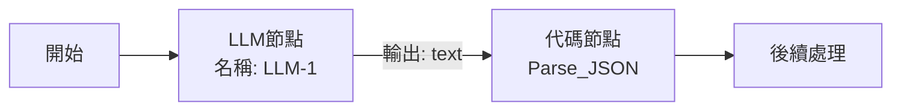

啊！我明白了，在 Dify 中 LLM 節點的輸出變數是固定的。讓我更正確地說明：

## 📌 **正確的 Dify 變數引用方式**

### **Step 1: LLM 節點（老師）的輸出**

當你創建了一個 LLM 節點後，它會自動產生這些輸出變數：
- `text` - 主要的生成內容（這是我們要的 JSON）
- `reasoning_content` - 推理內容
- `usage` - 模型用量信息

### **Step 2: 正確的輸入設定**

在你的代碼節點中，輸入變數應該這樣設定：

#### **在 Dify 介面操作：**

1. **找到你的 LLM 節點名稱**
   - 例如節點名稱是 `LLM` 或 `LLM-1`（看你的節點實際命名）

2. **在代碼節點的輸入變數設定：**
   ```yaml
   變數名稱: teacher_output
   變數類型: String
   變數來源: 點擊輸入框，選擇 {節點名稱}.text
   ```

### **實際操作示意：**

假設你的 LLM 節點名稱是 `LLM-1`，那麼：

```yaml
代碼節點設定：
├─ 節點名稱: Parse_JSON
├─ 輸入變數:
│  └─ 變數名: teacher_output
│      類型: String  
│      引用: {{LLM-1.text}}  # 這裡引用 LLM 節點的 text 輸出
└─ 程式碼: [貼上之前的 Python 代碼]
```

### **Step 3: 在代碼節點介面的具體操作**

1. **點擊代碼節點**
2. **在右側面板找到「輸入」區塊**
3. **點擊「+ 變數」**
4. **設定：**
   - 變數名稱：輸入 `teacher_output`
   - 在下方的輸入框點擊
   - 會彈出變數選擇器
   - 找到你的 LLM 節點（可能顯示為 `LLM` 或其他你命名的名稱）
   - 展開後選擇 `text`
   - 最終顯示類似：`{{LLM.text}}` 或 `{{LLM-1.text}}`

### **完整流程圖示：**



### **變數引用範例：**

如果你的節點是這樣命名的：
- LLM 節點名稱：`Teacher_AI` 
- 則引用：`{{Teacher_AI.text}}`

如果是系統預設名稱：
- LLM 節點名稱：`LLM-1`
- 則引用：`{{LLM-1.text}}`

### **代碼節點的完整設定截圖文字說明：**

```
┌─ 代碼節點 ─────────────────────────┐
│                                     │
│ 節點標題: Parse_JSON               │
│                                     │
│ [輸入]                             │
│ ├─ teacher_output                  │
│ │  類型: String                    │
│ │  值: {{LLM-1.text}} ← 這裡      │
│ └─                                 │
│                                     │
│ [代碼]                             │
│ def main(teacher_output: str):     │
│     import json                    │
│     import re                      │
│     # ... 其餘代碼                 │
│                                     │
│ [輸出]                             │
│ 類型: Object                       │
└─────────────────────────────────────┘
```

### **檢查步驟：**

1. **確認 LLM 節點的實際名稱**
   - 點擊 LLM 節點
   - 看上方的節點標題

2. **測試變數引用**
   - 在輸入框輸入 `{{`
   - 應該會自動彈出可選變數
   - 選擇對應節點的 `text`

3. **驗證連接**
   - 運行測試
   - 查看是否正確接收到 JSON 字串

### **如果還是找不到：**

請告訴我：
1. 你的 LLM 節點的確切名稱是什麼？
2. 在代碼節點的輸入變數區，當你點擊輸入框時，看到哪些可選的變數？

這樣我可以給你更精確的指導！
